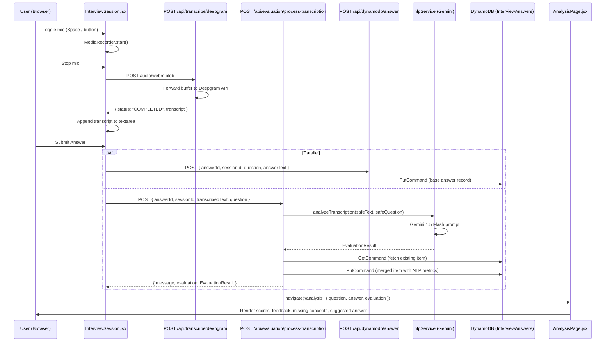

# Design Document: Evaluation Pipeline

## Overview

The evaluation pipeline is the core intelligence layer of IntervAI. It connects five discrete stages into a single, traceable flow:

1. **Voice capture** — browser MediaRecorder records audio/webm
2. **Transcription** — Deepgram Nova-2 converts audio to text
3. **NLP evaluation** — Google Gemini 1.5 Flash scores the answer
4. **Persistence** — DynamoDB stores the merged answer + metrics record
5. **Dashboard display** — AnalysisPage renders the evaluation via React Router state

The pipeline is designed for low latency (DynamoDB save and NLP evaluation run in parallel), graceful degradation (every external call has a fallback), and full traceability (a single `sessionId` + `answerId` pair links every write).

---

## Architecture



### Key Design Decisions

- **Parallel submission**: `Promise.all([saveAnswer, evaluate])` halves perceived latency. The evaluation route performs a `GetCommand` + `PutCommand` merge so it is safe even if the base answer write hasn't landed yet.
- **Stateless evaluation result**: The evaluation object is read directly from the `Promise.all` resolution, not from React state, to avoid stale closure bugs.
- **Single AWS config module**: All AWS SDK clients are initialised once in `utils/awsConfig.js` and imported by every route that needs them.
- **Graceful degradation**: Every external call (Deepgram, Gemini) has a defined fallback so the pipeline never hard-crashes.

---

## Components and Interfaces

### Frontend Components

#### `InterviewSession.jsx`
Orchestrates the full capture → transcription → submission flow.

| Responsibility | Detail |
|---|---|
| Mic toggle | `toggleMic()` — starts/stops `MediaRecorder`, calls `uploadAndTranscribe()` on stop |
| Transcription | `uploadAndTranscribe(blob)` — `POST /api/transcribe/deepgram` via `FormData` |
| Submission | `handleSubmit()` — `Promise.all([saveAnswer, evaluate])`, then navigates |
| Session ID | `sessionIdRef` — `session_<Date.now()>`, stable for the lifetime of the component |
| Answer ID | `ans_<Date.now()>` — generated at submit time, shared across both parallel requests |

State machine for `transcribeStatus`:
```
idle → recording → transcribing → done
                              ↘ error
```

#### `AnalysisPage.jsx`
Reads evaluation from React Router `location.state` and renders it.

| Prop (from state) | Rendered as |
|---|---|
| `question` | Question card |
| `answer` | Answer card (transcribed text) |
| `evaluation.fluencyScore` | Progress bar "Vocabulary & Fluency" |
| `evaluation.confidenceLevel` | Progress bar "Tone & Confidence" |
| `evaluation.relevanceScore` | Progress bar "Relevance to Question" |
| `evaluation.fillerWordsDetected` | Count badge in AI Summary card |
| `evaluation.overallFeedback` | AI Evaluation Summary paragraph |
| `evaluation.missingConcepts` | Tag list (hidden when empty or "No specific…") |
| `evaluation.suggestedAnswer` | AI Spec Model Answer section |
| computed `overallAvg` | Score ring — `Math.round((fluency + confidence + relevance) / 3)` |

### Backend Routes

#### `POST /api/transcribe/deepgram`
- Auth: none (audio upload is unauthenticated)
- Input: `multipart/form-data`, field `audio` (audio/webm)
- Output: `{ status: "COMPLETED", transcript: string }`
- Errors: 400 (no file), 401 (missing key), upstream status on Deepgram failure

#### `POST /api/evaluation/process-transcription`
- Auth: Firebase JWT (`verifyToken` middleware)
- Input: `{ answerId, sessionId, transcribedText, question? }`
- Output: `{ message: string, evaluation: EvaluationResult }`
- Errors: 400 (missing fields), 401 (bad token), 500 (NLP/DB failure)

#### `POST /api/dynamodb/answer`
- Auth: Firebase JWT
- Input: `{ answerId, sessionId, question, answerText, transcribedText }`
- Output: `{ message: "Answer saved successfully" }`

### Backend Services

#### `nlpService.analyzeTranscription(text, question)`
Pure async function. No side effects beyond the Gemini API call.

Input sanitization (applied in `evaluationRoutes.js` before calling the service):
```js
const safeText = text.replace(/[`\u0000-\u001F\u007F]/g, " ").trim();
```

Returns `EvaluationResult` (see Data Models).

---

## Data Models

### `EvaluationResult` (in-memory / API response)

```typescript
interface EvaluationResult {
  fluencyScore: number;        // 0–100
  confidenceLevel: number;     // 0–100
  relevanceScore: number;      // 0–100
  fillerWordsDetected: number; // non-negative integer
  overallFeedback: string;
  missingConcepts: string[];
  suggestedAnswer: string;
}
```

### DynamoDB: `InterviewAnswers` table

Primary key: `answerId` (String, partition key — no sort key)

| Attribute | Type | Source | Notes |
|---|---|---|---|
| `answerId` | S | Client | `ans_<timestamp>` |
| `sessionId` | S | Client | `session_<timestamp>` |
| `question` | S | Client | Raw question text |
| `answerText` | S | Client | Typed or transcribed text |
| `transcribedText` | S | Client / Deepgram | Sanitized before NLP |
| `s3AudioKey` | S | Client | Optional S3 key for audio file |
| `score` | N | Client | Legacy field, nullable |
| `timestamp` | S | Server | ISO 8601, set on initial save |
| `nlpFluencyScore` | N | NLP | 0–100 |
| `nlpConfidenceLevel` | N | NLP | 0–100 |
| `nlpRelevanceScore` | N | NLP | 0–100 |
| `nlpFillerWords` | N | NLP | ≥ 0 |
| `nlpFeedback` | S | NLP | Constructive feedback string |
| `nlpMissingConcepts` | L | NLP | List of concept strings |
| `nlpSuggestedAnswer` | S | NLP | Ideal answer text |
| `updated_at` | S | Server | ISO 8601, set on every NLP upsert |

The evaluation route performs a `GetCommand` before `PutCommand` to merge existing fields, so the two parallel writes (base answer + NLP metrics) converge correctly regardless of arrival order.

### DynamoDB: `InterviewSessions` table

Primary key: `sessionId` (String, partition key)

| Attribute | Type | Notes |
|---|---|---|
| `sessionId` | S | `session_<timestamp>` |
| `userId` | S | Firebase UID |
| `timestamp` | S | ISO 8601 session start |
| `resumeKey` | S | Optional S3 key |
| `status` | S | `STARTED` \| `COMPLETED` |

### Gemini Prompt Schema

The NLP service sends a zero-shot prompt requesting this exact JSON shape:

```json
{
  "fluencyScore": "<number 0-100>",
  "confidenceLevel": "<number 0-100>",
  "relevanceScore": "<number 0-100>",
  "fillerWordsDetected": "<integer>",
  "overallFeedback": "<string>",
  "missingConcepts": ["<string>"],
  "suggestedAnswer": "<string>"
}
```

The model is configured with `responseMimeType: "application/json"` to reduce the chance of markdown wrapping. A post-processing step strips any residual ` ```json ` fences before `JSON.parse`.

---

## Correctness Properties

*A property is a characteristic or behavior that should hold true across all valid executions of a system — essentially, a formal statement about what the system should do. Properties serve as the bridge between human-readable specifications and machine-verifiable correctness guarantees.*

### Property 1: Buttons disabled during active transcription

*For any* `transcribeStatus` value in `['uploading', 'transcribing']`, both the microphone button and the submit button SHALL be disabled in the rendered InterviewSession UI.

**Validates: Requirements 1.4**

---

### Property 2: Transcript extraction from Deepgram response

*For any* non-empty transcript string, when the Deepgram API returns a well-formed response with that string at `results.channels[0].alternatives[0].transcript`, the `/api/transcribe/deepgram` route SHALL return `{ status: "COMPLETED", transcript: <that string> }` unchanged.

**Validates: Requirements 2.2**

---

### Property 3: Upstream error status propagation

*For any* HTTP error status code in the range 400–599 returned by the Deepgram API, the `/api/transcribe/deepgram` route SHALL respond with that same status code.

**Validates: Requirements 2.4**

---

### Property 4: Transcript appended to textarea on success

*For any* non-empty transcript string returned by the transcription service, the InterviewSession SHALL append it to the `response` state and set `transcribeStatus` to `'done'`.

**Validates: Requirements 2.5**

---

### Property 5: Input sanitization removes injection characters

*For any* string containing backtick characters (`` ` ``) or ASCII control characters (code points 0x00–0x1F, 0x7F), the sanitized version produced by the evaluation route SHALL contain none of those characters.

**Validates: Requirements 3.2**

---

### Property 6: Markdown fence stripping preserves JSON content

*For any* valid `EvaluationResult` JSON object, wrapping it in any combination of markdown code fences (` ```json `, ` ``` `, or no fences) and passing it through the NLP service's fence-stripping + parse step SHALL produce an object equal to the original.

**Validates: Requirements 3.3**

---

### Property 7: NLP output scores are in valid ranges

*For any* transcribed text and question passed to `analyzeTranscription`, the returned `EvaluationResult` SHALL satisfy: `0 ≤ fluencyScore ≤ 100`, `0 ≤ confidenceLevel ≤ 100`, `0 ≤ relevanceScore ≤ 100`, and `fillerWordsDetected ≥ 0`.

**Validates: Requirements 3.6**

---

### Property 8: DynamoDB upsert preserves existing fields

*For any* existing `InterviewAnswers` item and any new `EvaluationResult`, the merged item written by the evaluation route SHALL contain all attribute keys from the existing item in addition to all NLP metric fields, with no existing field silently dropped.

**Validates: Requirements 4.2**

---

### Property 9: Every upsert sets a valid updated_at timestamp

*For any* valid call to `POST /api/evaluation/process-transcription`, the item written to DynamoDB SHALL contain an `updated_at` field whose value is a valid ISO 8601 datetime string.

**Validates: Requirements 4.3**

---

### Property 10: AnalysisPage renders all evaluation fields

*For any* valid `EvaluationResult` object passed as React Router state, the AnalysisPage SHALL render `fluencyScore`, `confidenceLevel`, `relevanceScore`, `fillerWordsDetected`, `overallFeedback`, `missingConcepts` (when non-empty and not "No specific…"), and `suggestedAnswer` in the appropriate UI sections.

**Validates: Requirements 6.2, 6.4, 6.5, 6.6, 6.7**

---

### Property 11: overallAvg is the correct arithmetic mean

*For any* triple `(fluencyScore, confidenceLevel, relevanceScore)` where each value is in `[0, 100]`, the `overallAvg` computed by AnalysisPage SHALL equal `Math.round((fluencyScore + confidenceLevel + relevanceScore) / 3)`.

**Validates: Requirements 6.3**

---

### Property 12: sessionId format invariant

*For any* InterviewSession component instance, the generated `sessionId` SHALL match the regular expression `/^session_\d+$/`.

**Validates: Requirements 8.1**

---

### Property 13: Both parallel requests use the same answerId

*For any* answer submission, the `answerId` value sent to `POST /api/dynamodb/answer` and the `answerId` value sent to `POST /api/evaluation/process-transcription` SHALL be identical.

**Validates: Requirements 8.5**

---

### Property 14: sessionId persisted in DynamoDB NLP record

*For any* valid call to `POST /api/evaluation/process-transcription` that includes a `sessionId`, the item written to DynamoDB SHALL contain that exact `sessionId` value.

**Validates: Requirements 8.4**

---

## Error Handling

| Stage | Failure | Behaviour |
|---|---|---|
| Mic access | `getUserMedia` rejected | `transcribeStatus = 'error'`, warning shown, pipeline stops |
| Transcription | Deepgram non-2xx | Route returns upstream status; frontend sets `transcribeStatus = 'error'` |
| Transcription | Missing API key | Route returns 401 immediately |
| NLP evaluation | Gemini unavailable / quota | `nlpService` catches error, returns labelled fallback `EvaluationResult` |
| NLP evaluation | Missing `GEMINI_API_KEY` | Throws `"GEMINI_API_KEY environment variable is missing."` |
| NLP evaluation | Malformed JSON from Gemini | `JSON.parse` throws; caught by outer try/catch, fallback returned |
| Evaluation route | Missing `answerId` or `transcribedText` | Returns HTTP 400 |
| Evaluation route | Invalid / missing JWT | `verifyToken` middleware returns HTTP 401 before any processing |
| Evaluation route | DynamoDB write failure | Returns HTTP 500; error logged |
| Parallel submission | Either request fails | `Promise.all` rejects; `InterviewSession` catches, logs, and continues session flow |
| AnalysisPage | No Router state | Default placeholder values rendered; page does not crash |

---

## Testing Strategy

### Unit Tests (example-based)

Focus on specific scenarios and integration points:

- `toggleMic()` calls `getUserMedia` and sets `isRecording = true`
- Stopping the mic calls `MediaRecorder.stop()` and invokes `uploadAndTranscribe`
- `handleSubmit()` dispatches both fetch calls and navigates with the evaluation from `Promise.all`
- `/api/transcribe/deepgram` returns 401 when `DEEPGRAM_API_KEY` is missing
- `/api/evaluation/process-transcription` returns 400 when `answerId` is absent
- AnalysisPage renders default placeholders when `location.state` is undefined
- `nlpService` returns fallback object when Gemini throws

### Property-Based Tests

Use **fast-check** (JavaScript) for all property tests. Each test runs a minimum of **100 iterations**.

Tag format: `// Feature: evaluation-pipeline, Property <N>: <property_text>`

| Property | Test approach |
|---|---|
| P1: Buttons disabled during transcription | Generate `transcribeStatus` from `['uploading', 'transcribing']`; render component; assert both buttons have `disabled` attribute |
| P2: Transcript extraction round-trip | Generate arbitrary non-empty strings; mock Deepgram response; assert returned transcript equals input |
| P3: Upstream error status propagation | Generate integers in [400, 599]; mock Deepgram to return that status; assert route response status matches |
| P4: Transcript appended on success | Generate arbitrary transcript strings; mock fetch; assert `response` state contains the string and `transcribeStatus === 'done'` |
| P5: Sanitization removes injection chars | Generate strings with arbitrary backtick/control char content; apply sanitization regex; assert no forbidden chars remain |
| P6: Markdown fence stripping | Generate valid `EvaluationResult` objects; wrap in fence variants; assert parse result equals original |
| P7: NLP output score ranges | Generate arbitrary text/question pairs; mock Gemini with boundary values; assert all score constraints hold |
| P8: DynamoDB upsert preserves fields | Generate arbitrary existing items and NLP metrics; run merge logic; assert all original keys present in merged output |
| P9: updated_at is valid ISO 8601 | Generate valid requests; assert `updated_at` matches ISO 8601 regex `/^\d{4}-\d{2}-\d{2}T\d{2}:\d{2}:\d{2}.\d+Z$/` |
| P10: AnalysisPage renders all fields | Generate arbitrary `EvaluationResult` objects; render page; assert each field appears in the DOM |
| P11: overallAvg arithmetic | Generate triples `(a, b, c)` in [0, 100]; assert `overallAvg === Math.round((a+b+c)/3)` |
| P12: sessionId format | Generate session instances; assert `sessionId` matches `/^session_\d+$/` |
| P13: Same answerId in both requests | Generate answer submissions; capture both fetch calls; assert `answerId` values are identical |
| P14: sessionId in DynamoDB record | Generate requests with arbitrary sessionId strings; assert persisted item contains that sessionId |

### Integration Tests

- Full pipeline smoke test: submit a real audio blob through transcription → evaluation → DynamoDB (staging environment)
- AWS config: verify all four clients (`S3Client`, `DynamoDBClient`, `DynamoDBDocumentClient`, `PollyClient`) are exported from `utils/awsConfig.js`
- Auth middleware: verify protected routes reject requests without a valid Firebase JWT
